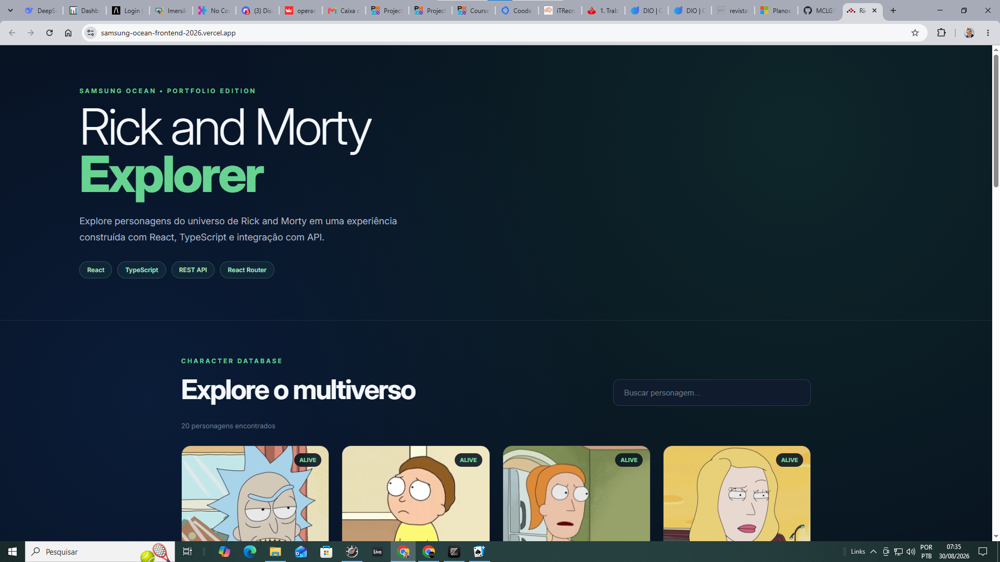
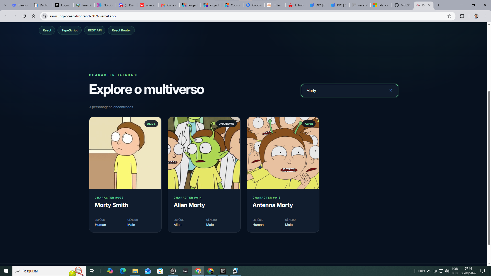

# ⚛️ Rick and Morty Explorer - Ocean Frontend 2026 — ReactJS

*Introdução ao Desenvolvimento Front-end com ReactJS*


 

Aplicação frontend desenvolvida com React e TypeScript para explorar personagens do universo de Rick and Morty por meio de integração com uma API REST.



---

## 🚀 Sobre o projeto

O **Rick and Morty Explorer** é uma aplicação frontend que permite visualizar e pesquisar personagens do universo de Rick and Morty de forma dinâmica e responsiva.

O projeto teve origem na formação **Frontend Web com ReactJS**, realizada no **Samsung Ocean**, onde foram trabalhados fundamentos de desenvolvimento frontend, JavaScript, React, criação de componentes e integração com aplicações backend.

Posteriormente, o projeto foi evoluído como iniciativa de portfólio, incorporando uma nova interface, TypeScript, consumo dinâmico de API, pesquisa de personagens e melhorias de experiência do usuário.

A evolução do projeto representa a aplicação prática dos conceitos estudados durante a formação, transformando o exercício inicial em uma aplicação frontend mais completa e apresentável.

---

## ✨ Funcionalidades

- 🔌 Integração com API REST
- 🔎 Pesquisa dinâmica de personagens por nome
- 🧩 Renderização dinâmica de componentes
- 🖼️ Exibição de imagem e informações dos personagens
- 🟢 Identificação visual do status do personagem
- 📱 Interface responsiva
- ⏳ Estado de carregamento
- ⚠️ Tratamento de erros na consulta à API
- 🎨 Interface desenvolvida especificamente para o projeto

---

## 🖥️ Interface

### Visão geral


### Busca de personagens

A pesquisa é realizada diretamente no frontend, permitindo filtrar os personagens carregados sem recarregar a página.



---

## 🛠️ Tecnologias

| Tecnologia | Aplicação |
|---|---|
| **React** | Construção da interface e componentes |
| **TypeScript** | Tipagem e estruturação da aplicação |
| **React Router** | Estrutura de rotas |
| **Vite** | Ambiente de desenvolvimento e build |
| **REST API** | Obtenção dos dados dos personagens |
| **CSS** | Layout, responsividade e identidade visual |
| **Vercel** | Deploy da aplicação |

---

## 🔄 Fluxo da aplicação

```text
Rick and Morty API
        │
        ▼
     Fetch API
        │
        ▼
   React / TypeScript
        │
        ├── Loading
        ├── Error Handling
        ├── Character State
        └── Search State
        │
        ▼
  Filtro de personagens
        │
        ▼
 Renderização dos cards
        │
        ▼
 Interface responsiva
```

---

## 🧠 Conceitos aplicados

Durante o desenvolvimento e evolução do projeto foram aplicados conceitos como:

- componentização em React;
- gerenciamento de estado com `useState`;
- efeitos e requisições assíncronas com `useEffect`;
- consumo de API com `fetch`;
- tipagem de dados com TypeScript;
- renderização de listas;
- filtragem dinâmica de dados;
- tratamento de estados de loading e erro;
- responsividade com CSS;
- separação entre dados, lógica e apresentação.

---

## 📂 Estrutura principal

```text
Samsung-Ocean-Frontend-2026/
│
├── app/
│   ├── routes/
│   │   └── home.tsx
│   ├── welcome/
│   ├── app.css
│   ├── root.tsx
│   └── routes.ts
│
├── images/
│   ├── rick-morty-explorer-home.png
│   └── rick-morty-explorer-search.png
│
├── public/
├── package.json
├── react-router.config.ts
├── tsconfig.json
├── vite.config.ts
└── README.md
```

---

## ▶️ Executando localmente

### 1. Clone o repositório

```bash
git clone https://github.com/MCLG1661/Samsung-Ocean-Frontend-2026.git
```

### 2. Entre no diretório

```bash
cd Samsung-Ocean-Frontend-2026
```

### 3. Instale as dependências

```bash
npm install
```

### 4. Execute o ambiente de desenvolvimento

```bash
npm run dev
```

A aplicação estará disponível no endereço indicado pelo terminal.

---

## 🌐 Aplicação online

A versão publicada pode ser acessada em:

**https://samsung-ocean-frontend-2026.vercel.app/**

---

## 🎓 Origem acadêmica

O projeto teve origem na atividade **Frontend Web com ReactJS: Introdução**, do **Samsung Ocean**, abordando fundamentos como:

- criação de projetos frontend;
- JavaScript;
- React;
- componentes;
- páginas;
- componentes interativos;
- integração frontend/backend.

A versão atual representa uma **evolução posterior para portfólio**, mantendo a proposta educacional original e ampliando sua implementação técnica e apresentação.

---

## 📈 Evolução do projeto

### Versão inicial

A implementação original apresentava uma interface introdutória para visualização de personagens, construída durante o processo de aprendizagem de React.

### Portfolio Edition

A versão atual evoluiu o projeto com:

- nova arquitetura da página;
- interface redesenhada;
- TypeScript;
- integração dinâmica com API;
- sistema de pesquisa;
- estados de loading e erro;
- responsividade;
- deploy em produção;
- documentação técnica.

Essa evolução demonstra não apenas a implementação de uma aplicação frontend, mas também a capacidade de **revisitar, refatorar e transformar um projeto educacional em uma solução mais estruturada**.

---

## 👨‍💻 Autor

**Marcus Guedes**

Projeto desenvolvido a partir dos conhecimentos adquiridos no Samsung Ocean e posteriormente evoluído como projeto de portfólio em desenvolvimento frontend, tecnologia e aplicações digitais.

- GitHub: **MCLG1661**
- LinkedIn: **Marcus Guedes**

---

## 📄 Licença

Este projeto possui finalidade educacional e de portfólio.

Os dados e imagens dos personagens são fornecidos pela API utilizada pela aplicação e pertencem aos seus respectivos detentores de direitos.
